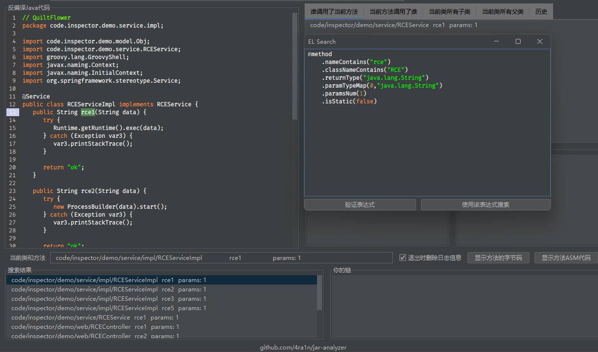

## 0.1-beta

nothing

## 0.2-beta

Bugs:
- [bug] right click on mac os not work #5
- [bug] mac os open too many files bug #6

Others:
- [new feature] jars in jar file situation #1
- [new feature] allow user input a jar directory #3

## 0.3-beta

Congratulates, I make some meaningful updates. Please note, run this on Java 11-17, other versions not support, 
and I had not test this on Mac OS and Linux, if you found a bug, please report a issue, much thanks. 
(In fact, I can chose a lower version of QuiltFlower so that this can run under Java 8, 
but I wonder if it's worth it, is there many Java 8 users?)

Support 3 ways to decompile class file:
- QuiltFlower (FernFlower)
- Procyon
- CFR

Rebuild UI and add a progress bar showing the progress of loading jars.

Interestingly, I have added some example cases in the README.md.

Finally, I made an exe version, but you need have a local JRE 11-17 environment.

Important:
- Add CFR and QuiltFlower decompilers #8
- [docs] add a more complex example case #9
- [new feature] a progress bar to show load jar progress #4

Bugs:
- [bug] code panel cannot resize #10

Others:
- [new feature] allow use null class name and search all methods #7

## 0.4-beta

This is a buf fix version, does not contain new features.
So I had not made an exe version, only a jar version.

I try to make the cursor as accurate as possible to point to the real method call position.
But I can't confirm all the situations. If you find any problems, you can ask for issue.
And I chose a lower version of QuiltFlower to support Java 8.

Important:
- [important] [bug] method position not accurate enough #2
- [important] [bug] the number of parameters does not match show info #16

Others:
- use quilt flower 1.8.1 to support Java 8 #15
- remove unnecessary dependencies to reduce jar file size

## 0.5-beta

New Features:
- [important] [feat] add a new panel to show your decompile history #13
- [important] [feat] add a panel to show subclasses and super classes #11
- [important] [feat] add a option to chose search directly or method call #19
- [feat] show formatted bytecode and asm code #18

Others:
- use quilt flower 1.8.1 to support Java 8 #15 (support 8 and 11)

## 0.6-beta

This is a special version, which support a new feature but is not stable

Change:
- Rebuild UI
- Spring Controller and Mapping Analysis
- New README

## 0.7

Important version: https://www.bilibili.com/video/BV1Pe4y1T7Ma

Bug:
- [important] [bug] cannot decompile spring class sometimes #28
- [important] [bug] spring should not contain duplicate content #31
- [bug] springboot loader class npe bug #30
- [bug] macos tabbed panel bug #25

Feature:
- [important] [feat] prompt the user why decompilation fails #33
- [important] [feat] support getmapping and postmapping #23
- [important] [feat] controller without controller anno #24
- [feat] prompt user what is inner jar and spring boot jar #35
- [feat] prompt user when the search result is empty #34
- [feat] delete logs when exit checkbox #32

Others:
- [important] [improve] code refactor #27
- [improve] show number should be changed to details #29
- [improve] spring analyze use asm 9 #26
- spring package is unnecessary (delete ui)
- new README and screenshot

## 0.8

重要更新版本，整体重构并新增多个功能

从该版本开始，仅支持`Java 11`以上，因为某些组件不能在`Java 8`正常运行，不过会提供包含`JRE`的`EXE`版本

更新内容：
- [important] 整体UI使用中文重构（我不觉得老外会使用） #40
- [important] 重写代码面板实现类似IDEA的效果 #49
- [important] 实现正则和包含搜索字符串的功能 #50
- [important] 实现直接从jar包搜索二进制的功能 #51
- [important] 实现无脑搜索（类/方法/字段/常量 任何地方） #52
- [important] 增加搜索字符串常量的功能 #47
- [important] 使用黑色主题完全重构UI #42
- [important] 增加一个常见搜索面板允许直接设置搜索内容 #60
- [important] 自动处理普通JAR/SpringBoot JAR/WAR区别 #59
- [important] [bug] 优化方法位置精确定位的算法 #41
- [feat] 支持分析war包 #58
- [feat] 新增菜单跳转issue和项目地址 #44
- [feat] 新增菜单验证当前最新版本 #45
- [feat] 应该增加一个面板显示目标类中有哪些方法 #54
- [feat] 应该对两种搜索方式给出提示 #37
- [bug] 提示框多屏情况下不在同屏显示 #46
- [bug] CFR反编译有时候不工作 #36
- [improve] 更优雅地查看字节码和ASM代码 #56
- [improve] 所有方法的显示应该进行排序以区分重载 #57
- [improve] 搜索结果应该去重 #53
- [improve] 给反编译代码使用更优雅的字体 #55
- [improve] 当选择反编译类时应该清空方法调用信息 #39

## 0.9

优化方法定位算法，修改并重新编译某些依赖库代码以支持`Java 8 - Java 19`所有版本

加入了简单的表达式搜索（beta）功能：

```java
#method
    .nameContains("方法名包含什么")
    .classNameContains("该方法类名包含什么")
    .returnType("方法返回值类型")
    .paramTypeMap(参数索引 (int),"参数索引类型")
    .paramsNum(参数个数 (int))
    .isStatic(是否静态 (boolean))
```

示例：

```java
#method
    .nameContains("rce")
    .classNameContains("RCE")
    .returnType("java.lang.String")
    .paramTypeMap(0,"java.lang.String")
    .paramsNum(1)
    .isStatic(false)
```



更新内容：
- [important] 适配JDK8-JDK19所有版本 #63
- [important] 解决在非JDK11-14中字体的BUG #64
- [important] 支持拖入Jar文件加载 #61
- [important] 表达式搜索 #62
- [important] 方法精确定位算法优化 #65

虽然现在支持了其他的`Java`版本，但还是建议使用`Java 11`

下载说明：
- `jar-analyzer-*.jar` 使用 `java -jar` 启动（使用`Java 8`以上启动，支持 `Windows/Mac/Linux`）
- `jar-analyzer-*-system-jre.exe` 使用系统`Java 8`以上启动（`Windows`）
- `jar-analyzer-*-jre-exe.zip` 内置`Java 11 JRE`和 `exe` 版本（`Windows`）

## 1.0

todo
