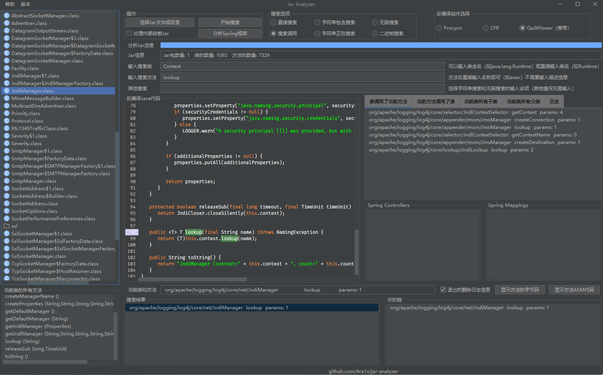
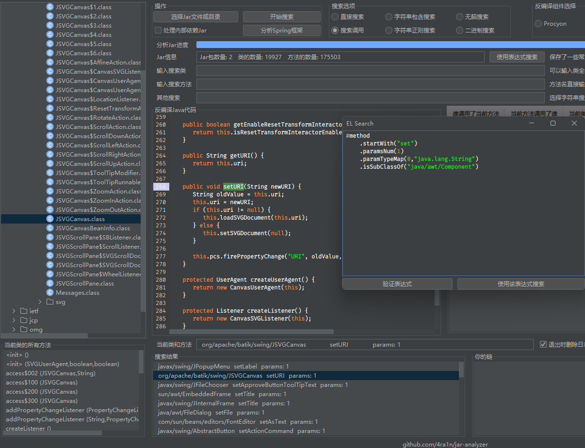

# Jar Analyzer


## Note

[Jar-Analyzer 命令行版本](https://github.com/4ra1n/jar-analyzer-cli)

[Jar-Analyzer Cli Version](https://github.com/4ra1n/jar-analyzer-cli)

## 介绍

简单的介绍：https://mp.weixin.qq.com/s/Rrx6x5M_28YRcQQCdxuEeQ

没有英文文档，老外请自行翻译

一个用于分析`jar`包的GUI工具，尤其适合从事代码安全审计。可以在同时分析多个`jar`文件，可以轻易地搜索目标方法。
支持反编译字节码并自动构建类和方法之间的关系，帮助Java安全研究员更高效地工作。

**注意：请勿分析过大或过多的的`Jar`包，建议最大不超过`300M`**

[前往下载](https://github.com/4ra1n/jar-analyzer/releases/latest)

可以精确定位方法的位置（左侧灰色游标高亮显示）



可以直接定位字符串（分析常量池相关指令实现精确定位）


可以直接分析`Spring`框架编写的项目


为什么不选择`IDEA`分析：**因为`IDEA`不支持分析无源码的Jar包**

支持六种搜索方式：
- 直接根据类和方法名搜索（搜索定义）
- 根据方法调用搜索（该方法在哪里被调用）
- 搜索字符串（分析`LDC`指令找到精确位置）
- 正则搜索字符串（分析`LDC`指令找到精确位置）
- 无脑搜索（分析相关指令找到精确位置）
- 二进制搜索（直接从二进制里搜）

支持选择三项反编译方式：
- QuiltFlower (FernFlower变种，推荐方式)
- Procyon
- CFR

使用类定制化的`JSyntaxPane`组件（非官方）来展示`Java`代码

（在该库`https://code.google.com/archive/p/jsyntaxpane`的基础上加了很多黑科技）

## 表达式搜索

支持一种超强的表达式搜索，可以随意组合以搜索你想要的信息

| 表达式               | 参数         | 作用       | 
|:------------------|:-----------|:---------|
| nameContains      | String     | 方法名包含    |
| startWith         | String     | 方法前缀     |
| endWith           | String     | 方法后缀     |
| classNameContains | String     | 类名包含     |
| returnType        | String     | 方法返回类型   |
| paramTypeMap      | int String | 方法参数对应关系 |
| paramsNum         | int        | 方法参数个数   |
| isStatic          | boolean    | 方法是否静态   |
| isSubClassOf      | String     | 是谁的子类    |
| isSuperClassOf    | String     | 是谁的父类    |
| hasAnno           | String     | 方法的注解    |
| hasClassAnno      | String     | 类的注解     |
| hasField          | String     | 类字段      |

注意：
- `returnType`和`paramTypeMap`要求类似是完整类名，例如`java.lang.String`，基础类型直接写即可例如`int`
- `isSubClassOf`和`isSuperClassOf`要求完整类名，例如`java.awt.Component`
- `hasAnno`和`hasClassAnno`不要求完整类名，直接写即可例如`Controller`


### 1.基础搜索

搜索的基础是方法，你希望搜索怎样的方法

例如我希望搜索方法名以`set`开头并以`value`结尾的方法

```java
#method
        .startWith("set")
        .endWith("value")
```

例如我希望搜索类名包含`Context`且方法名包含`lookup`的方法

```java
#method
        .nameContains("lookup")
        .classNameContains("Context")
```

例如我希望搜索返回`Process`类型共3个参数且第二个参数为`String`的方法

```java
#method
        .returnType("java.lang.Process")
        .paramsNum(3)
        .paramTypeMap(1,"java.lang.String")
```

### 2.子类与父类

比如我们想找`javax.naming.spi.ObjectFactory`的所有子类（包括子类的子类等）

编写以下规则即可，程序内部会递归地寻找所有的父类

```java
#method
        .isSubClassOf("javax.naming.spi.ObjectFactory")
```

如果想找某个类的所有父类，使用`isSuperClassOf`即可（注意全类名）

注意以上会直接找到所有符合条件类的所有方法，所以我建议再加一些过滤

例如

```java
#method
        .isSubClassOf("javax.naming.spi.ObjectFactory")
        .startWith("xxx")
        .paramsNum(0)
```

### 3.注解搜索

比如我们想找`@Controller`注解的所有类的所有方法

编写以下规则

```java
#method
        .hasClassAnno("Controller")
```

比如想找`@RequestMapping`注解的所有方法

```java
#method
        .hasAnno("RequestMapping")
```

同样地由于找到的是所有符合条件类的所有方法，所以我建议再加一些过滤

### 4.实战分析

根据网上师傅提供的`Swing RCE`条件：
- 必须有一个set方法
- set方法必须只有一个参数
- 这一个参数必须是string类型
- 该类必须是`Component`子类（包括间接子类）

因此我们编写一条规则

```java
#method
        .startWith("set")
        .paramsNum(1)
        .paramTypeMap(0,"java.lang.String")
        .isSubClassOf("java.awt.Component")
```

搜索结果



## Quick Start

重要：请使用`Java 8+`运行（推荐11并已提供内置`Java 11 JRE`的`EXE`版本）

（在`Java 11`中使用了一种更好的字体，其他版本使用默认字体）

(1) 第一步：添加`jar`文件（支持单个`jar`文件和`jar`目录）
- 点击按钮 `Select Jar File` 打开jar文件
- 支持上传多个jar文件并且会在一起进行分析

请不要着急，分析jar文件需要花费少量的时间

注意：请等到进度条满时分析完成

(2) 第二步：输入你搜索的信息

我们支持三种格式的输入：
- `javax.naming.Context` (例如)
- `javax/naming/Context`
- `Context` (会搜索所有 `*.Context` 类)

提供了一种快速输入的方式


注意：这里的常见搜索内容可以自定义补充

在当前目录新建`search.txt`文件，一行一个以`#`分割类名和方法，例如

```text
java.lang.Runtime#getRuntime
java.lang.String#equals
```

二进制搜索只会返回是否存在，不会返回具体信息


(3) 第三步：你可以双击进行反编译

游标将会精确地指向方法调用的位置

当反编译的过程中，方法之间的关系会被构建

在面板上的任何地方都可以双击进行反编译，并构建新的方法调用关系和展示

请注意：如果你遇到无法反编译的情况，你需要加载正确的jar文件

例如，我无法反编译`javax.naming.Context`因为我没有加入`rt.jar`文件，如果你加入了它，就可以正常反编译了

你可以使用`Ctrl+F`搜索代码和编辑

你可以单击任何一个选项，接下来将会显示方法的详细信息

你可以右键将选项发送到链中。你可以把链理解为一个收藏夹或记录。在链中你同样可以双击反编译，然后展示新的方法调用关系，或单机显示详情
如果链中某个选项是你不想要的，可以右键把该选项从链中删除

因此你可以构建出一个只属于你的调用链

`谁调用了当前方法` 和 `当前方法调用了谁` 中的所有方法调用关系同样可以双击反编译，单击看详情，右键加入链

可以一键查看当前类字节码


## 关于

(1) 什么是方法之间的关系

```java
class Test{
    void a(){
        new Test().b();
    }
    
    void b(){
        Test.c();
    }
    
    static void c(){
        // code
    }
}
```

如果当前方法是 `b`

谁调用了当前方法: `Test` class `a` method

当前方法调用了谁: `Test` class `c` method

(2) 如何解决接口实现的问题

```java
class Demo{
    void demo(){
        new Test().test();
    }
}

interface Test {
    void test();
}

class Test1Impl implements Test {
    @Override
    public void test() {
        // code
    }
}

class Test2Impl implements Test {
    @Override
    public void test() {
        // code
    }
}
```

现在我们有 `Demo.demo -> Test.test` 数据, 但实际上它是 `Demo.demo -> TestImpl.test`.

因此我们添加了新的规则： `Test.test -> Test1Impl.test` 和 `Test.test -> Test2Impl.test`.

首先确保数据不会丢失，然后我们可以自行手动分析反编译的代码
- `Demo.demo -> Test.test`
- `Test.test -> Test1Impl.test`/`Test.test -> Test2Impl.test`

(3) 如何解决继承关系

```java
class Zoo{
    void run(){
        Animal dog = new Dog();
        dog.eat();
    }
}

class Animal {
    void eat() {
        // code
    }
}

class Dog extends Animal {
    @Override
    void eat() {
        // code
    }
}

class Cat extends Animal {
    @Override
    void eat() {
        // code
    }
}
```
`Zoo.run -> dog.cat` 的字节码是 `INVOKEVIRTUAL Animal.eat ()V`, 但我们只有这条规则 `Zoo.run -> Animal.eat`, 丢失了 `Zoo.run -> Dog.eat` 规则

这种情况下我们添加了新规则： `Animal.eat -> Dog.eat` 和 `Animal.eat -> Cat.eat`

首先确保数据不会丢失，然后我们可以自行手动分析反编译的代码
- `Zoo.run -> Animal.eat`
- `Animal.eat -> Dog.eat`/`Animal.eat -> Cat.eat`
