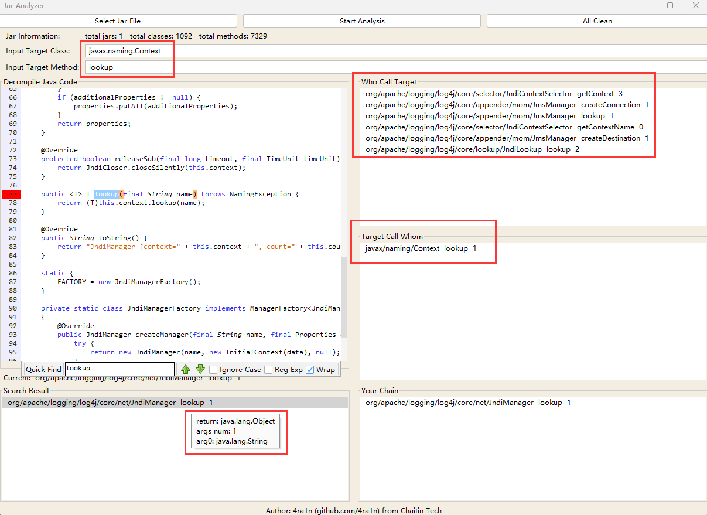
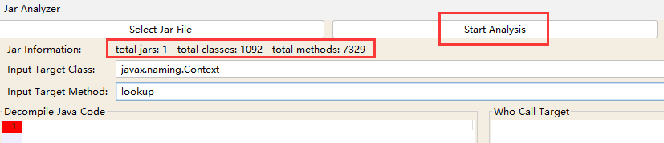
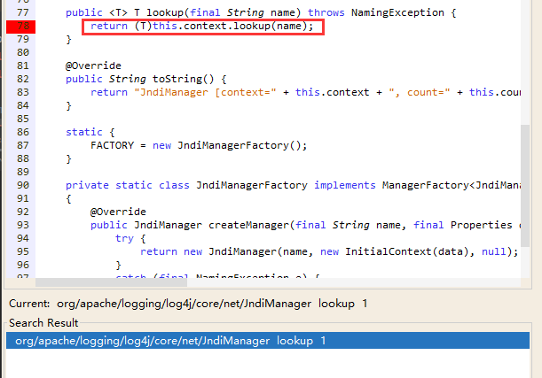
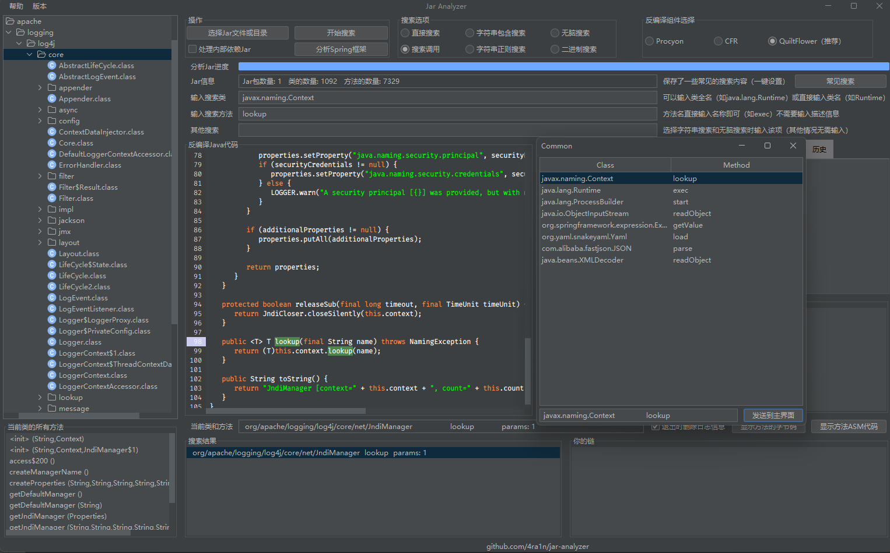
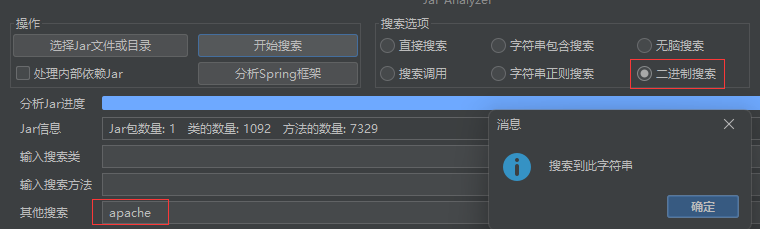
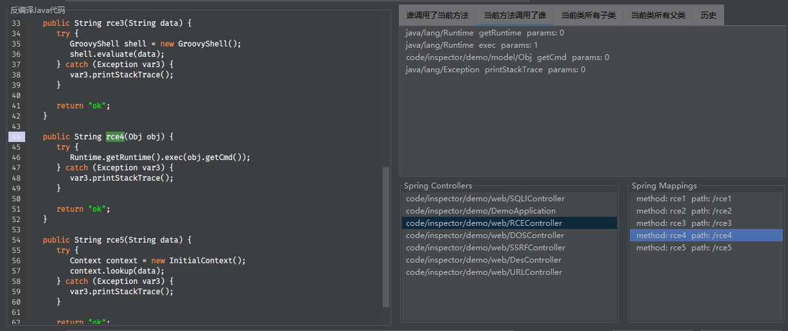

# Jar Analyzer


## Introduce

A GUI project for analyzing `jar` packages, especially suitable for code security analysis.
Multiple `jar` packages can be analyzed at the same time, and you can easily search methods in them.
Support decompile of class files, automatically build call relationships between classes and methods, 
help experienced Java code analysts improve efficiency.
For detailed use of this tool, refer to Quick Start.



Core Module:
- Java Decompiler API: https://github.com/mstrobel/procyon
- Flat Look and Feel UI: https://github.com/JFormDesigner/FlatLaf
- JSyntaxPane: https://code.google.com/archive/p/jsyntaxpane

We use customized JSyntaxPane (not official) to show Java code.

## How to build

```shell
git clone https://github.com/4ra1n/jar-analyzer
cd jar-analyzer
mvn package
```

## Quick Start

(1) First Step: Add Jars file.
- Open jar file with button `Select Jar File`.
- Support to upload multiple Jar files which will be analyzed together.

(2) Second Step: Input your search data.

We support three format input:
- `javax.naming.Context` (For example)
- `javax/naming/Context`
- `Context` (With search all `*.*.Context` class)

Method input only needs a simple name, no description.

Please Note: if the jar is large, the initialization will take some time (`rt.jar` cost 10 seconds)



At this time, you can see the number of all the classes and methods analyzed.

(3) Third Step: You can double-click to decompile the result.

The red cursor will point to the corresponding method as far as possible, not all cases will be handled correctly.



When decompiling, the relationship between methods will be built.

Please Note: If you cannot decompile like the below screenshot, you can add the corresponding jar. 
For example, We did not add the `rt.jar` of JDK in the situation. If you add it, you can decompile successfully.



You can one-click to chose item, and then the item will show the method details.



You can right-click to send the item to your chain. Chain can be understood as a favorite.
In chain list, you can also double-click to decompile and one-click to show details.
If the item in chain is not what you want, you can right-click to remove it from chain.

So you can build a chain between methods for yourselves easily.



The relationship items (`Who call target` and `Target call whom` panel) between methods can also be used in the above way.
Click to display details, double-click to decompile, and right-click to add to the chain.


## About

(1) What is the relationship between methods:

```java
class Test{
    void a(){
        new Test().b();
    }
    
    void b(){
        Test.c();
    }
    
    static void c(){
        // code
    }
}
```

If current item is method `b`

Who call target: `Test` class `a` method

Target call whom: `Test` class `c` method

(2) How do we resolve implementation:

```java
class Demo{
    void demo(){
        new Test().test();
    }
}

interface Test {
    void test();
}

class Test1Impl implements Test {
    @Override
    public void test() {
        // code
    }
}

class Test2Impl implements Test {
    @Override
    public void test() {
        // code
    }
}
```

Now we have `Demo.demo -> Test.test` data, but actually it is `Demo.demo -> TestImpl.test`. 

In this case, We added new rules: `Test.test -> Test1Impl.test` and `Test.test -> Test2Impl.test`.

Ensure no loss of results, then we can analyze it ourselves manually with automatically decompiled java code:
- `Demo.demo -> Test.test`
- `Test.test -> Test1Impl.test`/`Test.test -> Test2Impl.test`

(3) How do we resolve inheritance:

```java
class Zoo{
    void run(){
        Animal dog = new Dog();
        dog.eat();
    }
}

class Animal {
    void eat() {
        // code
    }
}

class Dog extends Animal {
    @Override
    void eat() {
        // code
    }
}

class Cat extends Animal {
    @Override
    void eat() {
        // code
    }
}
```

The bytecode in `Zoo.run -> dog.cat` is `INVOKEVIRTUAL Animal.eat ()V`, so we only have one rule `Zoo.run -> Animal.eat`, lost `Zoo.run -> Dog.eat` rule.

In this case, We added new rules: `Animal.eat -> Dog.eat` and `Animal.eat -> Cat.eat`.

Ensure no loss of results, then we can analyze it ourselves manually with automatically decompiled java code:
- `Zoo.run -> Animal.eat`
- `Animal.eat -> Dog.eat`/`Animal.eat -> Cat.eat`
