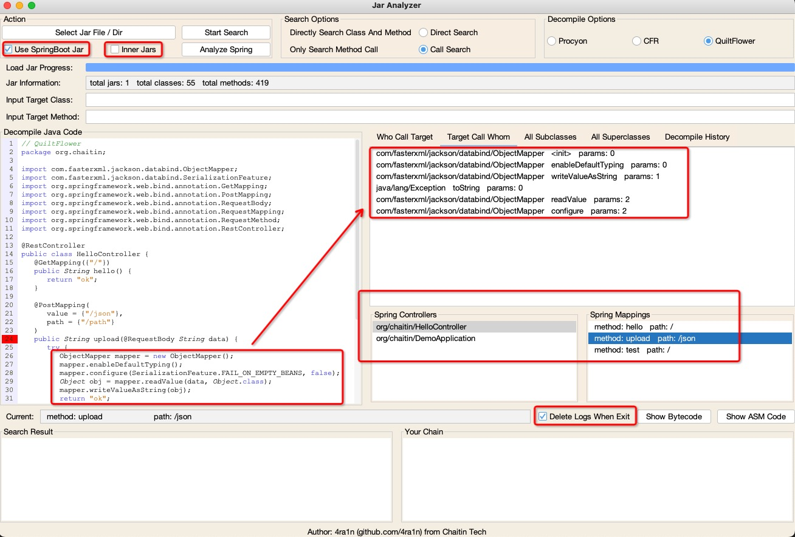
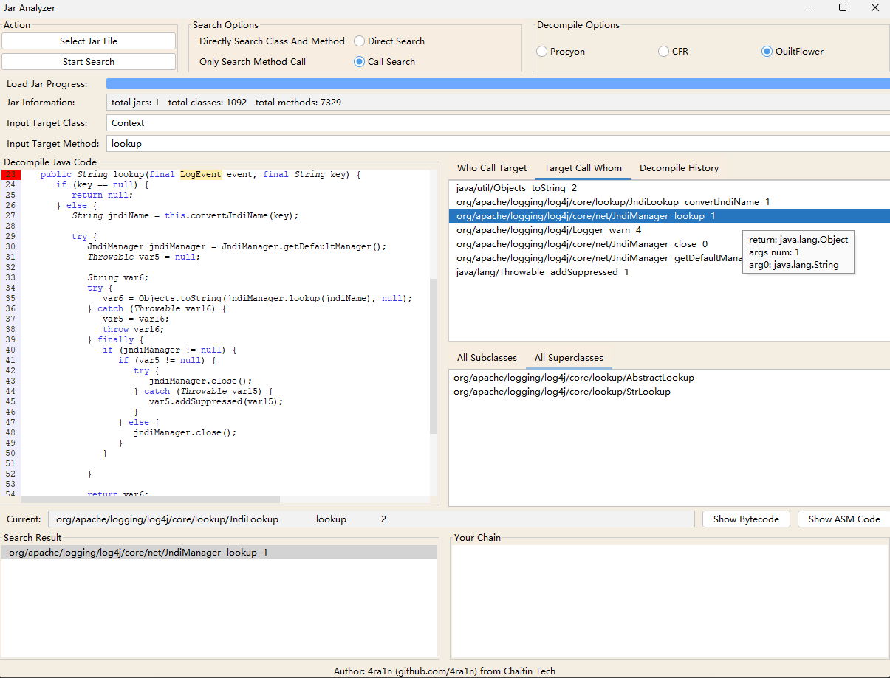
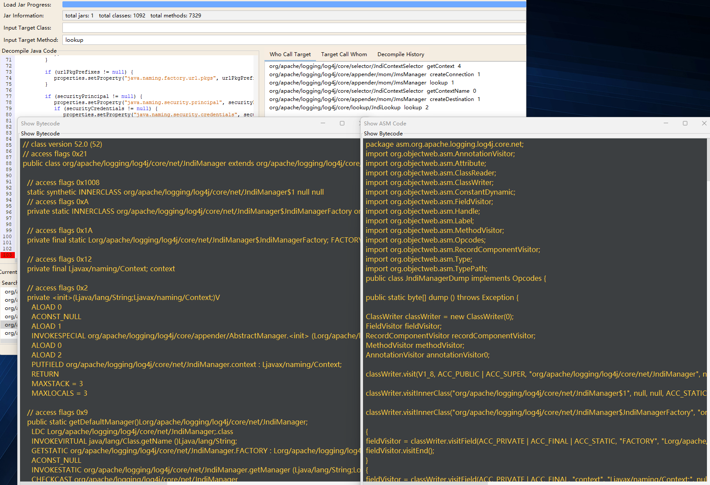

# Jar Analyzer


## 介绍

一个用于分析`jar`包的GUI工具，尤其适合从事代码安全审计。可以在同时分析多个`jar`文件，可以轻易地搜索目标方法。
支持反编译字节码并自动构建类和方法之间的关系，帮助Java安全研究员更高效地工作。
更多细节在 Quick Start中。

[前往下载](https://github.com/4ra1n/jar-analyzer/releases/latest)

支持选择三项反编译方式：
- QuiltFlower (FernFlower)
- Procyon
- CFR

支持Spring的Mapping分析：



我们使用类定制化的`JSyntaxPane`组件（非官方）来展示`Java`代码

一些截图：



你可以很方便地查看字节码和ASM代码。



## 如何构建

```shell
git clone https://github.com/4ra1n/jar-analyzer
cd jar-analyzer
mvn package
```

## Quick Start

重要：请使用Java 8 - Java 17运行

(1) 第一步：添加`jar`文件（支持单个`jar`文件和`jar`目录）
- 点击按钮 `Select Jar File` 打开jar文件
- 支持上传多个jar文件并且会在一起进行分析

请不要着急，分析jar文件需要花费少量的时间。

注意：请等到标签显示classes和methods总数时分析完成。

(2) 第二步：输入你搜索的信息

我们支持三种格式的输入：
- `javax.naming.Context` (例如)
- `javax/naming/Context`
- `Context` (会搜索所有 `*.Context` 类)

我们支持两种搜索方式：
- 直接根据类和方法名搜索
- 根据方法调用搜索

方法输入只需要一个简单的名称，不需要`desc`信息。

请注意：如果jar非常大，初始化会比较耗时（例如`rt.jar`会消耗10秒左右）

同时，你可以看到顶部显示已加载的类和方法数量。

(3) 第三步：你可以双击进行反编译

红色的游标将会尽可能地指向方法调用的位置，但目前不能保证所有情况。

当反编译的过程中，方法之间的关系会被构建。

在面板上的任何地方都可以双击进行反编译，并构建新的方法调用关系和展示。

请注意：如果你遇到无法反编译的情况，你需要加载正确的jar文件。
例如，我无法反编译`javax.naming.Context`因为我没有加入`rt.jar`文件，如果你加入了它，就可以正常反编译了。

你可以使用`Ctrl+F`搜索代码和编辑

你可以单击任何一个选项，接下来将会显示方法的详细信息。

你可以右键将选项发送到链中。你可以把链理解为一个收藏夹或记录。在链中你同样可以双击反编译，然后展示新的方法调用关系，或单机显示详情。
如果链中某个选项是你不想要的，可以右键把该选项从链中删除。

因此你可以构建出一个只属于你的调用链。

`Who call target` 和 `Target call whom` 中的所有方法调用关系同样可以双击反编译，单击看详情，右键加入链。

## 关于

(1) 什么是方法之间的关系：

```java
class Test{
    void a(){
        new Test().b();
    }
    
    void b(){
        Test.c();
    }
    
    static void c(){
        // code
    }
}
```

如果当前方法是 `b`

Who call target: `Test` class `a` method

Target call whom: `Test` class `c` method

(2) 如何解决接口实现的问题：

```java
class Demo{
    void demo(){
        new Test().test();
    }
}

interface Test {
    void test();
}

class Test1Impl implements Test {
    @Override
    public void test() {
        // code
    }
}

class Test2Impl implements Test {
    @Override
    public void test() {
        // code
    }
}
```

现在我们有 `Demo.demo -> Test.test` 数据, 但实际上它是 `Demo.demo -> TestImpl.test`.

因此我们添加了新的规则： `Test.test -> Test1Impl.test` 和 `Test.test -> Test2Impl.test`.

首先确保数据不会丢失，然后我们可以自行手动分析反编译的代码：
- `Demo.demo -> Test.test`
- `Test.test -> Test1Impl.test`/`Test.test -> Test2Impl.test`

(3) 如何解决继承关系：

```java
class Zoo{
    void run(){
        Animal dog = new Dog();
        dog.eat();
    }
}

class Animal {
    void eat() {
        // code
    }
}

class Dog extends Animal {
    @Override
    void eat() {
        // code
    }
}

class Cat extends Animal {
    @Override
    void eat() {
        // code
    }
}
```
`Zoo.run -> dog.cat` 的字节码是 `INVOKEVIRTUAL Animal.eat ()V`, 但我们只有这条规则 `Zoo.run -> Animal.eat`, 丢失了 `Zoo.run -> Dog.eat` 规则。

这种情况下我们添加了新规则： `Animal.eat -> Dog.eat` 和 `Animal.eat -> Cat.eat`.

首先确保数据不会丢失，然后我们可以自行手动分析反编译的代码：
- `Zoo.run -> Animal.eat`
- `Animal.eat -> Dog.eat`/`Animal.eat -> Cat.eat`
